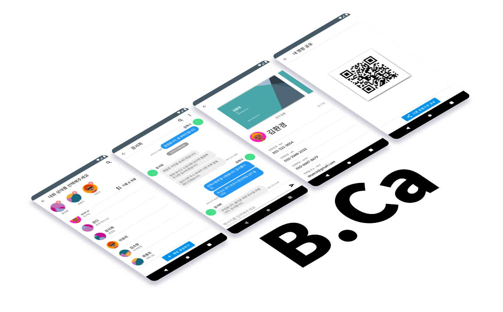

# 이 저장소는 더 이상 사용되지 않습니다!
작업 스케줄러는 Celery를 사용하도록 재작성되면서 [API 서버 저장소](https://github.com/MU-Software/bca_backend)에 병합되었습니다.  
이 저장소는 과거 제 졸업 프로젝트로 사용되었던 것의 기록으로써 남아있으며, 더 이상 작동하지 않습니다.  
아래 내용은 과거의 내용을 기반으로 하고 있으며, 현재에는 적용되지 않을 수 있습니다.  

# B.Ca 작업 스케줄러 저장소
B.Ca는 제 졸업작품으로 진행된, 명함을 중점으로 한 커뮤니케이션 메신저 프로젝트입니다.  
이 저장소는 Python으로 작성된 작업 스케줄러 코드를 포함하고 있습니다.  

# 프로젝트 구조
이 프로젝트는 간단하게 안드로이드 클라이언트, 현재 보고계신 API 서버, 그리고 작업 스케쥴러로 이루어져 있습니다.  
* 안드로이드 클라이언트: 제곧내입니다(...)  
* API 백엔드 서버: 모든 HTTP REST 요청을 처리합니다.  
* 작업 스케줄러: 현재 보시고 계신 이 저장소 입니다. 작업 스케줄러는 유저 동기화 DB 파일들 수정과 같은 오래 걸리는 작업들을 API 서버 대신 수행합니다. AWS SQS와 Lambda 위에서 돌아갑니다.  

### AWS 의존성
이 프로젝트는 AWS의 몇몇 서비스 위에서 동작합니다. 예를 들면, 작업 스케줄러는 AWS SQS와 AWS Lambda, 그리고 AWS S3 위에서 동작하는 것을 의도하여 작성되었습니다. 아래 표는 AWS의 어떠한 서비스를 사용하는지를 나타냅니다.  
서비스명 | 사용처
|   :----:   | :----
S3           | 유저의 동기화 될 DB 파일들을 저장할 파일 스토리지. 유저가 업로드한 파일은 API 서버에 저장됩니다.  
SQS          | 작업 스케줄러의 메시지 큐로 사용됩니다. 하나의 작업마다 하나의 Lambda 인스턴스가 실행됩니다.  
Lambda       | 작업 스케줄러의 Worker 인스턴스로 사용됩니다.  
